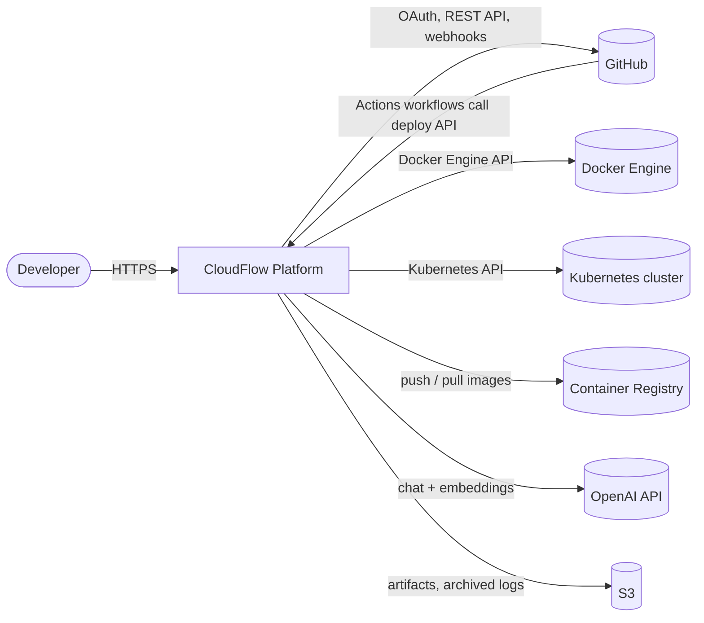
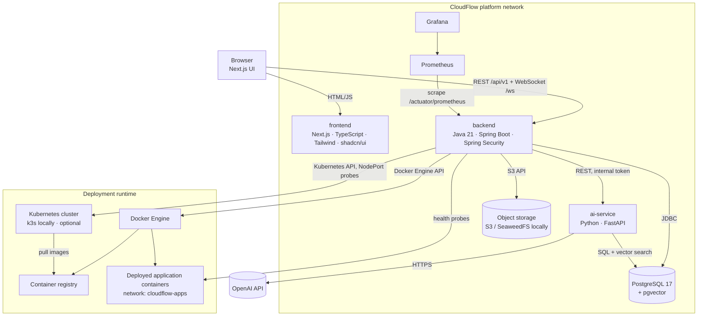
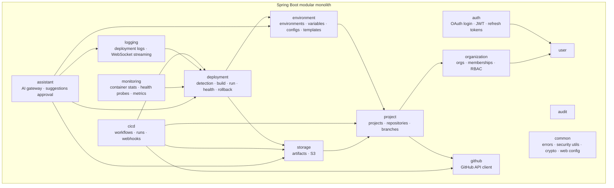
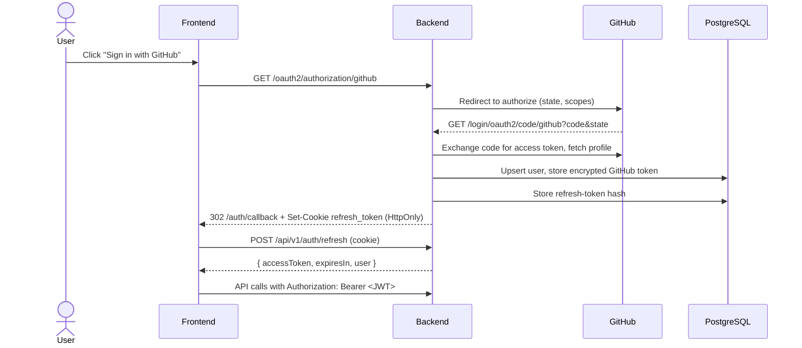
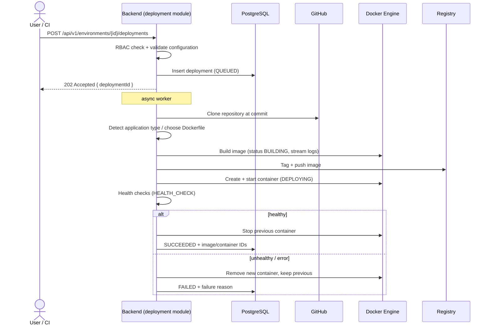
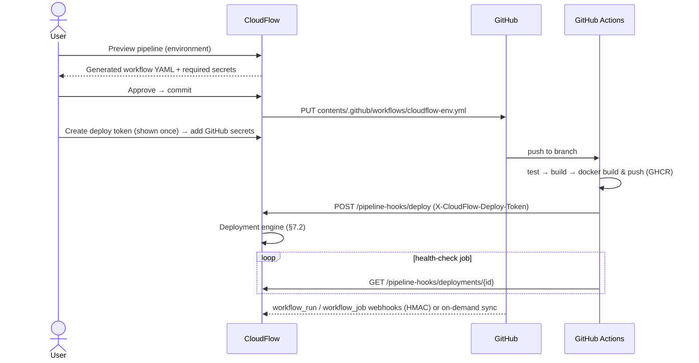
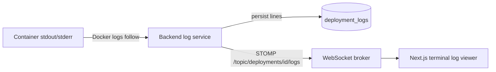
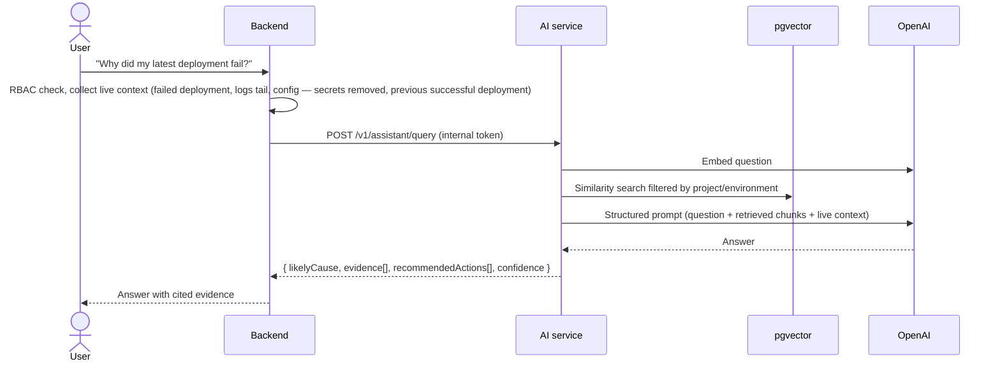

# CloudFlow — Architecture

This document describes CloudFlow's system architecture, component structure, and main data flows.
Requirements and the RBAC matrix are in [requirements.md](requirements.md). The data model is in
[database.md](database.md), API contracts in [api.md](api.md), and runtime topology in
[deployment.md](deployment.md).

## 1. Architectural style

- **Modular monolith backend.** One Spring Boot application, split into business modules with clear
  boundaries. It deploys as one unit, which avoids the operational cost of microservices while keeping
  modules separable.
- **Independent AI service.** AI and RAG run in a separate FastAPI (Python) application. Python has the
  best AI/RAG ecosystem, and isolating the service keeps model latency and failures away from the
  core platform.
- **Stateless API.** JWT access tokens and no server-side HTTP session, so the backend can scale
  horizontally.
- **Layered modules.** Inside each module: `web` (controllers, DTO mapping) → `service` (business
  rules, transactions) → `repository` (Spring Data JPA) → `domain` (JPA entities).

## 2. System context



## 3. Container view



| Container | Responsibility | Technology |
| --- | --- | --- |
| frontend | User interface. Server state through TanStack Query, client state (session, UI) through Zustand. | Next.js (App Router), TypeScript, Tailwind CSS, shadcn/ui |
| backend | Authentication, RBAC, all business logic, GitHub integration, deployment engine, CI/CD, logs, metrics, and the audit log. The only component browsers call for data. | Java 21, Spring Boot, Spring Security, Spring Data JPA, Flyway |
| ai-service | Retrieval, prompt construction, OpenAI calls, embeddings, and indexing. Stateless apart from its `ai` schema. | Python, FastAPI, OpenAI SDK, pgvector |
| PostgreSQL | System of record (`public` schema, owned by backend) and vector store (`ai` schema, owned by ai-service). | PostgreSQL 17 + pgvector |
| Docker Engine + registry | Builds all images; runs applications on the Docker target. | Docker |
| Kubernetes cluster | Second deployment target (Phase 10), chosen per environment. k3s runs it locally under the `kubernetes` Compose profile. | Kubernetes (fabric8 client) |
| Object storage | Artifacts: build outputs, generated files, archived deployment logs (Phase 10). Amazon S3 in production, SeaweedFS (S3-compatible) locally. | S3 API (AWS SDK for Java v2) |
| Prometheus / Grafana | Metrics collection and dashboards (Phase 7). | Prometheus, Grafana |

The plan's architecture also lists Redis. It is added once the platform scales past one backend
instance (for example, shared rate-limit counters and the WebSocket broker). Until then, each backend
instance keeps this state in memory; see [future-scope.md](future-scope.md).

## 4. Backend module structure



Module rules:

1. A module exposes a public **service API** (its `service` package) and DTOs. Other modules never
   use another module's repositories or entities directly.
2. Dependencies point in one direction, as shown in the diagram. Cycles are not allowed.
3. `common` holds only cross-cutting code (error model, security helpers, encryption, configuration),
   never business logic.
4. Cross-module side effects such as AI indexing and live log fan-out use Spring application
   events, so the module that publishes an event does not depend on the module that handles it.
   Audit logging is the exception: `audit` is a leaf module (it depends only on `common`) and services
   call `AuditLogger` directly, so the audit entry is written in the same transaction as the change
   it records and cannot be lost after a commit.

### Package layout

```
com.cloudflow
├── CloudFlowApplication.java
├── common/                # shared kernel
│   ├── config/            # web, CORS, Jackson, async configuration
│   ├── exception/         # exception types + global ProblemDetail handler
│   ├── security/          # JWT filter, current-user resolution, permission evaluator
│   ├── crypto/            # AES-GCM encryption service for secrets and tokens
│   └── web/               # paging DTOs, API constants
└── <module>/              # e.g. organization, project, deployment
    ├── domain/            # JPA entities and enums
    ├── dto/               # request/response records
    ├── repository/        # Spring Data repositories
    ├── service/           # business logic (interfaces + implementations when useful)
    └── web/               # REST controllers (and WebSocket handlers)
```

## 5. Frontend structure

```
src/
├── app/                   # App Router routes (layouts, pages)
├── components/
│   ├── ui/                # shadcn/ui primitives
│   ├── providers/         # QueryClientProvider and other providers
│   └── <feature>/         # feature components (projects, deployments, logs, …)
├── lib/
│   ├── api/               # typed API client (token refresh, Problem Details) + per-module requests
│   ├── query-keys.ts      # TanStack Query keys
│   └── env.ts             # public runtime configuration
├── hooks/                 # TanStack Query hooks per feature
└── stores/                # Zustand stores (auth session, UI state)
```

- **Server state** (anything fetched from the API) lives only in TanStack Query.
- **Client state** (access token in memory, the selected organization, UI preferences) lives in Zustand.
- The access token is kept in memory only. The refresh token is an HttpOnly cookie that JavaScript
  cannot read.
- Routes under the `(platform)` route group are wrapped in `AuthGuard`. On first load it restores
  the session from the refresh cookie, or redirects to `/login?returnTo=…`.
- The API client refreshes the access token once on a `401` and retries the request. Concurrent
  refreshes share one request, because refresh tokens rotate.

## 6. AI service structure

```
app/
├── main.py                # FastAPI application factory
├── core/                  # settings, logging, security (internal token check)
├── api/routes/            # health, analysis, generation, assistant, indexing
├── services/              # log analysis, generation, retrieval, prompt building
├── rag/                   # chunking, embeddings, vector store (pgvector)
└── schemas/               # Pydantic request/response models
```

## 7. Key data flows

### 7.1 GitHub sign-in (Phase 2)



### 7.2 Deployment (Phase 5)



#### Deployment engine internals

| Component | Responsibility |
| --- | --- |
| `DeploymentService` | API operations: authorize, validate the configuration (`422`), ensure nothing is in flight, persist a `QUEUED` deployment, publish `DeploymentQueuedEvent`. |
| `DeploymentDispatcher` | After commit, submits the deployment to the bounded `deploymentTaskExecutor` (default 2 workers, queue 50). If the queue is full, the deployment fails. |
| `DeploymentRunner` | Runs the steps below. Never holds a DB transaction during slow work; each step is persisted by `DeploymentStateService`. |
| `SourceFetcher` + `TarballExtractor` | Resolves the ref to a commit and downloads the GitHub tarball of that exact commit with the triggering user's token. Extracts safely: rejects path traversal and escaping symlinks, caps the size. |
| `DockerfileGenerator` | Multi-stage, non-root Dockerfiles for the Java (Maven/Gradle), Node.js, and Python templates. The Docker template uses the repository's own Dockerfile. |
| `ContainerRuntime` / `DockerContainerRuntime` | Deployment-target abstraction; the Docker implementation uses docker-java. Operations: build, push, pull, run (network, published port, `/data` volume, CPU/memory limits, labels, restart policy), inspect, logs, remove. |
| `HealthChecker` | HTTP probes. 2xx/3xx counts as healthy. The runner also fails fast if the container exits or restarts. |
| `DeploymentLogSink` | Persists log lines, masking secret values and truncating very long lines. |
| `DeploymentRecovery` | On startup, marks in-flight deployments failed and removes their containers. |

Naming: image `<registry>/<org-slug>/<project-slug>:<env>-<sha7>-<deployment8>`, container
`cf-<project-slug>-<env>-<deployment8>`, volume `cf-data-<environment-id>` mounted at `/data`.
Containers get the environment's variables plus `PORT`, `CLOUDFLOW_ENVIRONMENT`,
`CLOUDFLOW_DEPLOYMENT_ID`, and `CLOUDFLOW_DATA_DIR`.

### 7.2b CI/CD pipeline (Phase 6)



#### Deployment targets (Phase 10)

The engine talks to one `ContainerRuntime` facade. `RoutingContainerRuntime` builds and pushes every
image with Docker, then starts the workload on the environment's target (`DeploymentConfig.target`):

| | Docker | Kubernetes |
| --- | --- | --- |
| Workload | one container on `cloudflow-apps` | one `Deployment` (1 replica) + `NodePort` `Service` in namespace `cloudflow-apps` |
| Workload id | Docker container id | `k8s:<namespace>/<name>` |
| Data volume | named volume `cf-data-<envId>` | `PersistentVolumeClaim` `cf-data-<envId>` |
| Health probe | container name (or published port) | `<node-host>:<nodePort>` |
| Metrics | Docker stats | kubelet summary API (`/nodes/<node>/proxy/stats/summary`) |
| Hardening | non-root image, limits, `no-new-privileges`, PID limit | limits, `allowPrivilegeEscalation: false`, `RuntimeDefault` seccomp, no service-account token |

Later calls (inspect, logs, stats, remove) are routed by the workload id, so an environment can move
between targets: the new workload starts on the new target and the previous one is retired on the old
target once the new one is healthy. The blue/green flow, failure handling, and rollback are identical
for both targets.

#### Artifact storage (Phase 10)

The `storage` module keeps artifact metadata in `artifacts` and the content in one bucket under
`projects/<projectId>/<kind>/<uuid>/<file>`. Producers call `ArtifactService.storeAsync` from their
own module; uploads run on a small bounded executor and failures are only logged, so storage can never
fail a deployment or commit.

| Kind | Produced by | Content |
| --- | --- | --- |
| `BUILD_ARTIFACT` | deployment engine | the Dockerfile the image was built from; the vulnerability report (JSON) |
| `GENERATED_FILE` | CI/CD, assistant | committed workflow files; approved AI-generated files |
| `ARCHIVED_LOG` | `DeploymentLogArchiver` | the full log of every finished deployment (already secret-masked) |

Downloads go through the API (`DEPLOYMENT_READ`), never through public bucket URLs. Deleting a
project deletes its objects.

### 7.3 Live logs (Phase 7)



### 7.4 AI troubleshooting with RAG (Phase 8)



## 8. Cross-cutting concerns

| Concern | Approach |
| --- | --- |
| Error handling | RFC 9457 Problem Details (`application/problem+json`) from one global exception handler. |
| Validation | Jakarta Bean Validation on request DTOs. Domain rules are checked in services. |
| Authorization | Spring Security with a JWT resource-server filter. A permission evaluator checks organization membership and role for each request. |
| Secrets | AES-256-GCM through a single `EncryptionService`. The key comes from the environment (`CLOUDFLOW_ENCRYPTION_KEY`). |
| Persistence | PostgreSQL. Flyway migrations are the only way to change the schema (`ddl-auto: validate`). |
| Async work | Deployments and builds run on a dedicated bounded executor. Progress is persisted, so status never depends on an in-memory job. |
| Real-time | Spring WebSocket with STOMP at `/ws`: JWT checked on CONNECT, RBAC on every SUBSCRIBE, in-memory broker (single instance). Deployment log lines and status changes are pushed as they happen. Container output is followed only while subscribed. |
| Monitoring | `MonitoringCollector` samples every live container every 15 seconds (Docker stats and inspect, plus an HTTP probe), stores probe results and events, and exposes Micrometer gauges to Prometheus on the internal management port. |
| Observability | Spring Boot Actuator health probes and Micrometer Prometheus registry. |
| Audit | Services call `AuditLogger` inside their transaction → append-only `audit_logs` table. Read through `GET /organizations/{id}/audit-logs` (`AUDIT_READ`). |
| Rate limiting | `RateLimitFilter` (after bearer authentication) with in-memory token buckets per user / deploy token / IP; separate budgets for auth, AI, CI hooks, and webhooks. |
| Secure headers | Spring Security headers on the API (strict CSP, `DENY` framing, `no-referrer`); CSP and security headers for the UI in `next.config.ts`. |
| Supply chain | Every built image is scanned with Trivy (`TrivyImageScanner`, run as a container) between build and push. `ScanPolicy` records `PASSED` / `VULNERABLE`, or `BLOCKED` when `block-on-critical` is on. A scanner failure never blocks a deployment (`ERROR`). |
| Container hardening | Deployed apps run as non-root (generated Dockerfiles), with CPU/memory limits, `no-new-privileges`, and a PID limit of 512. Platform services in Compose all get `no-new-privileges` (the `x-hardening` anchor) and per-service CPU/memory limits. |

## 9. Architecture decisions

| # | Decision | Rationale |
| --- | --- | --- |
| AD-1 | Modular monolith backend | Required by the plan. Lowest operational complexity with clear boundaries. |
| AD-2 | Separate FastAPI AI service, called only by the backend | Keeps RBAC enforcement in one place and isolates AI latency and failures. |
| AD-3 | One PostgreSQL instance, schema-per-owner (`public` = backend, `ai` = ai-service) | Simple operations. Each service owns and migrates only its own schema. |
| AD-4 | Roles and permissions defined in code | The four roles are fixed. Keeping the policy in code gives compile-time safety (see requirements §4). |
| AD-5 | Access token in memory + refresh token in HttpOnly cookie | Protects tokens from XSS while keeping the API stateless. |
| AD-6 | Flyway for schema migrations | Versioned, reviewable, reproducible database changes. |
| AD-7 | Deployment state persisted at every step | Status survives restarts and gives a full history for troubleshooting and AI analysis. |
| AD-8 | Audit writes are synchronous and transactional, not event-driven | An audit trail that can silently miss entries is not an audit trail. |
| AD-9 | Trivy runs as a throwaway container | No scanner binary in the backend image; the vulnerability DB is cached in a named volume. |
| AD-10 | In-memory rate limits | Single instance today. Redis-backed buckets are listed as future scope in the plan. |
| AD-11 | Kubernetes behind the existing `ContainerRuntime` interface, images still built by Docker | One engine, one blue/green flow, and the same history, logs, and monitoring for both targets. |
| AD-12 | Artifacts streamed through the API instead of pre-signed URLs | Keeps RBAC in the backend and works when the bucket is only reachable on an internal network. |
| AD-13 | SeaweedFS as the local S3-compatible store | Apache-2.0 and actively maintained; the backend only speaks the S3 API, so production uses Amazon S3 unchanged. |
