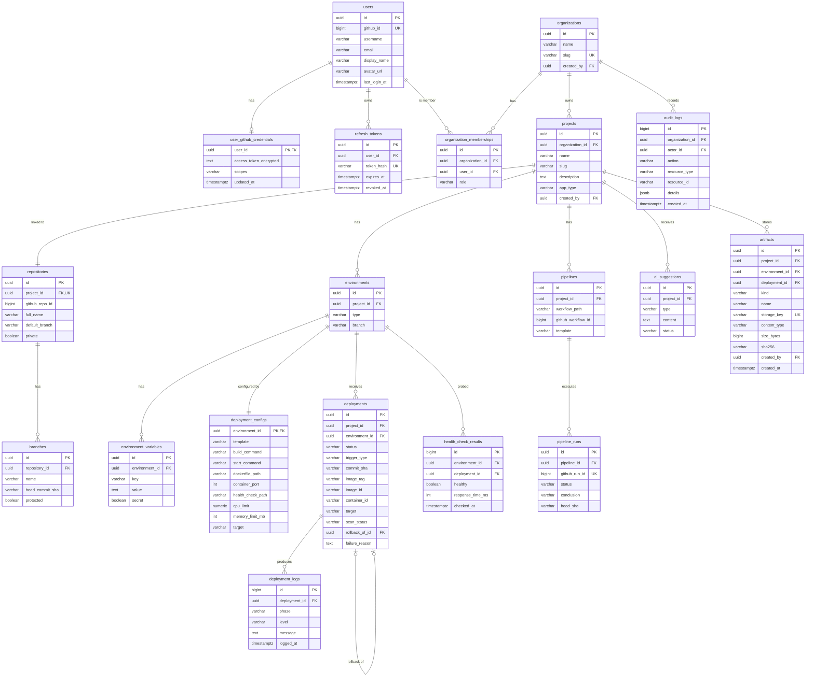

# CloudFlow — Database Design

CloudFlow uses one PostgreSQL 17 instance with the **pgvector** extension. It has two schemas:

| Schema | Owner | Migrations |
| --- | --- | --- |
| `public` | backend | Flyway — `backend/src/main/resources/db/migration/V<n>__<description>.sql` |
| `ai` | ai-service | Managed by the AI service (Phase 8) |

Neither service writes to the other's schema. The AI service gets platform data (deployments, logs,
configuration) from the backend through its API, never by reading `public` tables.

## Conventions

- Primary keys are `uuid` values generated by the database (`gen_random_uuid()`). Exception:
  high-volume append-only tables (`deployment_logs`, `audit_logs`, `health_check_results`) use `bigint` identity keys.
- Timestamps are `timestamptz`, stored in UTC, named `*_at`. Mutable tables have `created_at` and `updated_at`.
- Enumerations are `varchar` columns with a `CHECK` constraint and map to Java enums (`@Enumerated(STRING)`).
- Table names are plural `snake_case`. Foreign keys are named `<entity>_id` and every one is indexed.
- Encrypted values are stored as `text` in the format `v1:<base64(iv ‖ ciphertext ‖ tag)>`, encrypted with AES-256-GCM.
- Schema changes are made only through new Flyway migrations. Existing migrations are never edited.

## Entity-relationship diagram

## Table reference

The phase column shows which migration introduces each table.

### Identity and organizations (Phase 2)

| Table | Purpose | Key constraints |
| --- | --- | --- |
| `users` | A CloudFlow user, created on first GitHub sign-in and refreshed on each login. | `github_id` unique; `lower(username)` unique |
| `user_github_credentials` | The user's GitHub OAuth access token (encrypted) and granted scopes, used for GitHub API calls. | PK = `user_id`, cascade on user delete |
| `refresh_tokens` | Refresh-token rotation. Only a SHA-256 hash of each token is stored. | `token_hash` unique; index on `user_id` |
| `organizations` | Tenant boundary. Owns projects and memberships. | `slug` unique |
| `organization_memberships` | Links a user to an organization with a role (`OWNER`, `ADMIN`, `DEVELOPER`, `VIEWER`). Cascades on organization or user delete. | unique (`organization_id`, `user_id`); `CHECK` on role |

### Projects and GitHub (Phase 3)

| Table | Purpose | Key constraints |
| --- | --- | --- |
| `projects` | A CloudFlow project inside an organization. `app_type` is detected from the repository (`JAVA_MAVEN`, `JAVA_GRADLE`, `NODE`, `PYTHON`, `DOCKERFILE`, `UNKNOWN`). | unique (`organization_id`, `slug`) |
| `repositories` | The GitHub repository linked to a project (id, owner/name, URLs, default branch, visibility, language, last sync). The JPA entity is `SourceRepository`; the project is the aggregate root, and repository and branches are saved and deleted with it. | unique `project_id` (1:1); index on `github_repo_id` (one project per repository per organization, enforced in the service) |
| `branches` | Synced branch metadata (head commit, protection). | unique (`repository_id`, `name`) |

### Environments (Phase 4)

| Table | Purpose | Key constraints |
| --- | --- | --- |
| `environments` | `DEVELOPMENT`, `STAGING`, or `PRODUCTION` per project, with its deploy branch. | unique (`project_id`, `type`) |
| `environment_variables` | Key/value pairs. When `secret = true`, `value` holds AES-GCM ciphertext and is never returned by the API. `updated_by` records the last editor. | unique (`environment_id`, `key`); `CHECK` key matches `^[A-Z_][A-Z0-9_]*$` |
| `deployment_configs` | One-to-one deployment configuration per environment: template (`JAVA`, `NODE`, `PYTHON`, `DOCKER`), runtime version, build and start commands, Dockerfile path, port, health-check path, CPU and memory limits. | PK = `environment_id`; `CHECK` on template and port range |

### Deployments (Phase 5)

| Table | Purpose | Key constraints |
| --- | --- | --- |
| `deployments` | One deployment attempt. Status lifecycle: `QUEUED → BUILDING → DEPLOYING → HEALTH_CHECK → SUCCEEDED`, or `FAILED` / `CANCELLED`. A deployment replaced by a rollback becomes `ROLLED_BACK`. Records trigger (`MANUAL`, `PIPELINE`, `ROLLBACK`), branch, resolved commit, detected app type, image tag and ID, container ID/name, host port, `active` (currently serving), timestamps, and failure reason. | indexes on (`environment_id`, `created_at desc`) and (`project_id`, `created_at desc`); **partial unique** index on `environment_id` for in-progress statuses (one in flight per environment); **partial unique** index on `environment_id` where `active` (one serving deployment); `rollback_of_id` self-FK |
| `deployment_logs` | Append-only log lines with phase (`SOURCE`, `BUILD`, `PUSH`, `DEPLOY`, `HEALTH_CHECK`, `RUNTIME`) and level (`INFO`, `WARN`, `ERROR`). Identity PK gives a stable order for incremental polling. | index (`deployment_id`, `id`) |

### CI/CD (Phase 6)

| Table | Purpose | Key constraints |
| --- | --- | --- |
| `pipelines` | The GitHub Actions workflow CloudFlow generated for one environment: path, template, commit that added or updated it, GitHub workflow id, last sync time. | unique `environment_id`; unique (`project_id`, `workflow_path`) |
| `pipeline_runs` | Workflow runs mirrored from GitHub (run number/attempt, event, status, conclusion, branch, SHA, commit subject, actor, URL, timing). | unique `github_run_id`; index (`pipeline_id`, `run_number desc`) |
| `pipeline_run_jobs` | Jobs of a run (test, build, docker, deploy, health-check) with status, conclusion, and timing. | unique `github_job_id` |
| `deploy_tokens` | Per-environment CI credentials: name, SHA-256 hash, display prefix, creator, last use, revocation. | unique `token_hash` |

`deployments.pipeline_run_id` links a pipeline-triggered deployment to its GitHub Actions run.

### Monitoring (Phase 7)

| Table | Purpose | Key constraints |
| --- | --- | --- |
| `health_check_results` | Periodic probe results (every 15 seconds): healthy flag, HTTP status, response time, error. Used for uptime, response-time, and error-rate summaries. Kept for 7 days. | index (`environment_id`, `checked_at desc`) |
| `environment_events` | Environment timeline: deployment outcomes, health changes, restarts, stopped containers, each with a severity. Kept for 30 days. | index (`environment_id`, `created_at desc`) |

Container resource metrics (CPU, memory, network, restarts) are exposed to Prometheus and stored
there, not in PostgreSQL.

### AI (Phase 8)

| Table | Purpose |
| --- | --- |
| `ai_suggestions` (public) | AI-generated Dockerfiles, environment templates, workflows, and docs. Status: `PENDING` → `APPLIED` (after a user applies it; `result` records the commit or created variables) or `REJECTED`. |
| `ai.documents` | An indexed source (README, Dockerfile, compose file, config, doc, environment, deployment record, log excerpt), unique per (`project_id`, `source_ref`), with environment and deployment ids, metadata, and a SHA-256 content hash used to skip unchanged sources. |
| `ai.chunks` | Overlapping text chunks (about 1500 characters, 200 overlap) with an `embedding vector(1536)`, indexed with HNSW (cosine distance). |

The AI service applies its own migrations at startup (`ai-service/app/db/migrations`), under a
Postgres advisory lock so concurrent instances do not race.

### Security, targets, and storage (Phases 9–10)

| Table | Purpose |
| --- | --- |
| `audit_logs` | Append-only record of authentication, membership, configuration, and deployment actions (actor, action, resource, JSON details, IP address). `bigint` identity key; `organization_id` is null for account-level events (sign-in). The actor's username is copied so entries stay readable after the user is deleted (`actor_id` → `SET NULL`). |
| `deployments` (V9 columns) | `scan_status`, `vulnerabilities_critical`, `vulnerabilities_high`: Trivy result for the deployed image. |
| `artifacts` | Metadata of objects in the artifact bucket (Phase 10): `kind` is `BUILD_ARTIFACT`, `GENERATED_FILE`, or `ARCHIVED_LOG`; `storage_key` locates the object; `sha256` and `size_bytes` describe the content. Rows cascade with the project (objects are deleted by the backend); `environment_id` and `deployment_id` become null when those are deleted. |
| `deployment_configs.target`, `deployments.target` (V10) | Deployment target (`DOCKER` or `KUBERNETES`) chosen for the environment and used by each deployment. For Kubernetes deployments `container_id` holds `k8s:<namespace>/<name>` and `host_port` the NodePort. |

## Migration status

| Migration | Phase | Contents |
| --- | --- | --- |
| — | 1 | Flyway configured. No tables yet: each table is created in the phase that implements it. |
| `V1__identity_and_organizations.sql` | 2 | `users`, `user_github_credentials`, `refresh_tokens`, `organizations`, `organization_memberships` |
| `V2__projects.sql` | 3 | `projects`, `repositories`, `branches` |
| `V3__environments.sql` | 4 | `environments`, `environment_variables`, `deployment_configs` |
| `V4__deployments.sql` | 5 | `deployments`, `deployment_logs` |
| `V5__cicd.sql` | 6 | `pipelines`, `pipeline_runs`, `pipeline_run_jobs`, `deploy_tokens`; `deployments.pipeline_run_id` |
| `V6__monitoring.sql` | 7 | `health_check_results`, `environment_events` |
| `V7__ai_suggestions.sql` | 8 | `ai_suggestions` |
| `V8__audit_logs.sql` | 9 | `audit_logs` |
| `V9__image_scanning.sql` | 9 | Scan columns on `deployments`; `SCAN` log phase |
| `V10__deployment_targets.sql` | 10 | `target` on `deployment_configs` and `deployments` |
| `V11__artifacts.sql` | 10 | `artifacts` |
| ai-service `0001_ai_schema.sql` | 8 | `vector` extension; schema `ai`: `documents`, `chunks` (HNSW cosine index), `schema_migrations` |
