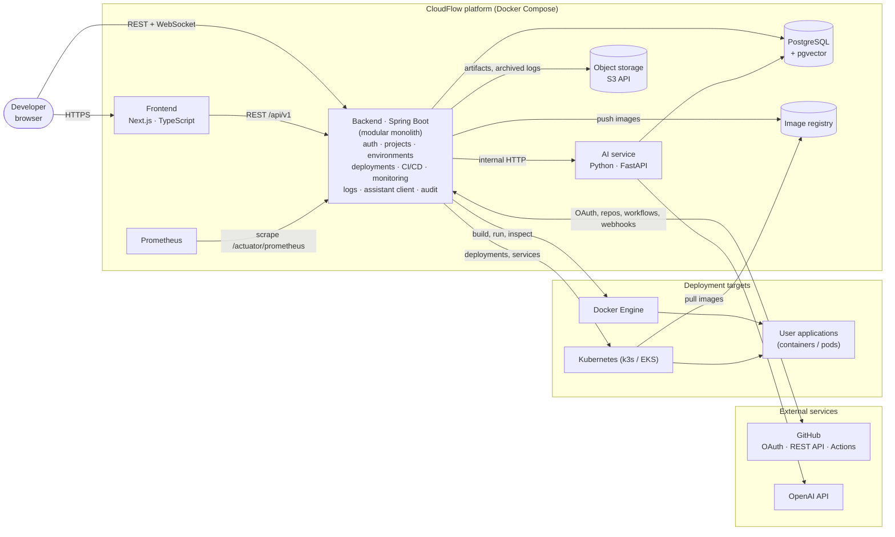
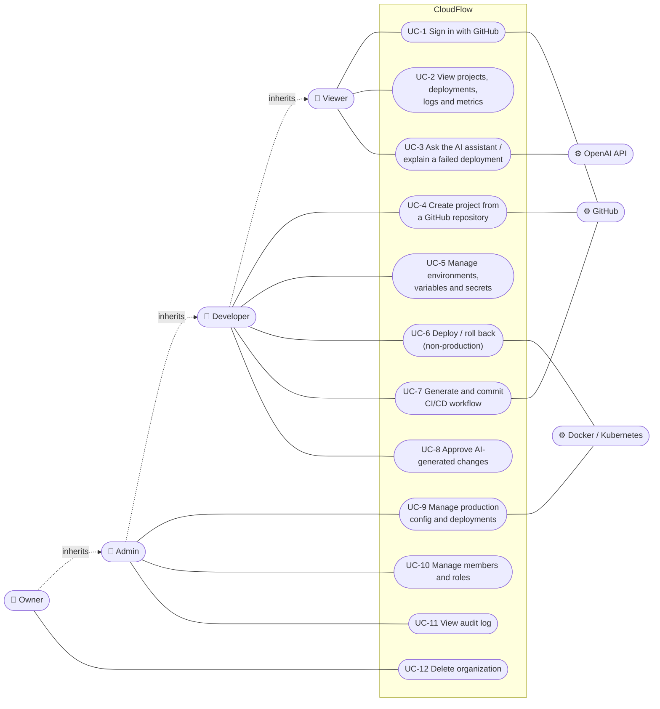
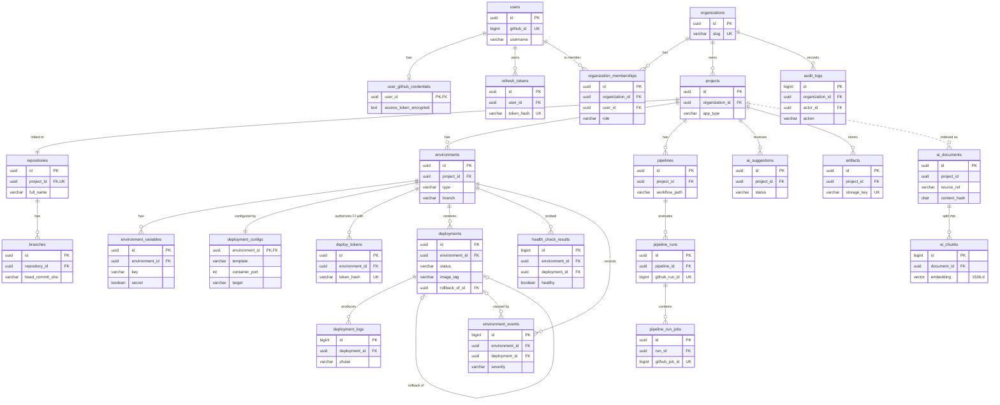
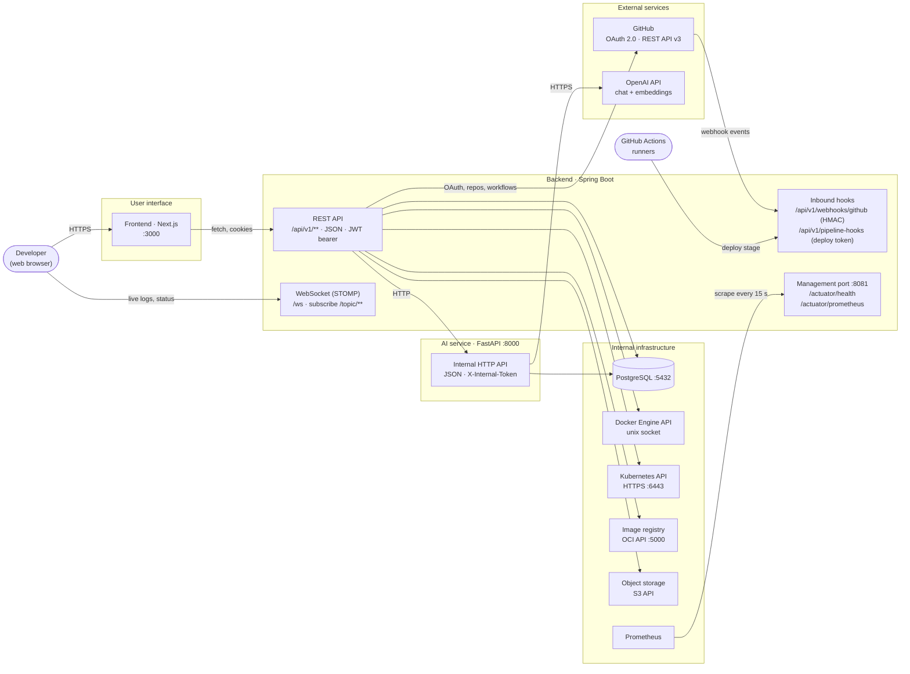

# CloudFlow — Requirements

## Aim

The aim of CloudFlow is to develop an AI-assisted Internal Developer Platform that unifies
application development, configuration, deployment, CI/CD, monitoring, logging, and
troubleshooting into a single platform, reducing operational complexity and enabling developers to
build and deploy software more efficiently and reliably.

CloudFlow is an AI-assisted Internal Developer Platform (IDP). It gives developers one interface for
project management, environment configuration, containerized deployment, CI/CD, monitoring, logging,
and AI-assisted troubleshooting. **It is not an AI chatbot**: AI is an assistance layer over the
platform, and every AI answer is grounded in project-specific evidence.

The implementation plan (`CloudFlow_Implementation_Plan.pdf`) is the source of truth. The phase in
brackets shows where each requirement is implemented.

## 1. Actors

| Actor | Description |
| --- | --- |
| Developer (end user) | Signs in with GitHub and works inside one or more organizations. Their **role** in each organization decides what they can do. |
| GitHub | Identity provider (OAuth), source of repositories, and CI runner (GitHub Actions). |
| Docker Engine | Builds images and runs deployed application containers. |
| OpenAI API | Language model and embedding provider, used only through the AI service. |

## 2. Functional requirements

### FR-1 Authentication and RBAC [Phase 2]

- FR-1.1 Users sign in with GitHub OAuth. On first sign-in CloudFlow creates the user from their GitHub profile.
- FR-1.2 After sign-in the backend issues a short-lived JWT access token and a rotating refresh token (HttpOnly cookie).
- FR-1.3 Every API request (except the public auth and health endpoints) needs a valid access token.
- FR-1.4 Users can sign out, which revokes their refresh token.
- FR-1.5 Users can create organizations. The creator becomes the organization **Owner**.
- FR-1.6 Owners and Admins can add existing CloudFlow users to an organization, change member roles, and remove members.
- FR-1.7 Each organization always has at least one Owner.
- FR-1.8 Access follows the RBAC matrix in §4.

### FR-2 GitHub and Project Management [Phase 3]

- FR-2.1 Users can list the GitHub repositories they can access through the connected GitHub account.
- FR-2.2 Users can view a repository's branches, recent commits, pull requests, and metadata.
- FR-2.3 Users can create a CloudFlow project from a GitHub repository inside an organization.
- FR-2.4 CloudFlow stores project, repository, and branch metadata and can re-sync it from GitHub.
- FR-2.5 A project dashboard shows the project's repository, environments, recent deployments, and pipeline status.

### FR-3 Environment and Configuration Management [Phase 4]

- FR-3.1 Each project has up to three environments: Development, Staging, and Production.
- FR-3.2 Users can manage environment variables. Variables marked as secret are encrypted at rest (AES-256-GCM) and never returned in plain text after they are written.
- FR-3.3 Each environment has a deployment configuration: template, branch, build and start commands, Dockerfile path, container port, health-check path, and resource limits.
- FR-3.4 Configuration templates exist for Java, Node.js, Python, and Dockerfile-based projects.
- FR-3.5 A configuration is validated before every deployment. Invalid configurations are rejected with field-level errors.
- FR-3.6 Only Owners and Admins can change Production configuration and secrets.

### FR-4 Containerization and Deployment Engine [Phase 5]

- FR-4.1 CloudFlow detects the application type from `pom.xml`, `build.gradle`, `package.json`, `requirements.txt` / `pyproject.toml`, and `Dockerfile`.
- FR-4.2 A deployment clones the selected branch or commit and builds a Docker image, generating a Dockerfile from the template when the repository has none.
- FR-4.3 Images are tagged `<registry>/<org>/<project>:<env>-<shortSha>` and pushed to the container registry.
- FR-4.4 CloudFlow runs the container with the environment's variables, port mapping, volumes, network, and resource limits.
- FR-4.5 After start, CloudFlow runs health checks and records deployment status, image ID, container ID, and timestamps.
- FR-4.6 A failed deployment keeps the previous healthy container running. Users can roll back to any earlier successful deployment.

### FR-5 CI/CD Pipeline [Phase 6]

- FR-5.1 CloudFlow generates GitHub Actions workflows for the supported stacks with these stages: test → build → Docker build → image push → deploy → health check.
- FR-5.2 A generated workflow is committed to the repository only after the user approves it.
- FR-5.3 CloudFlow tracks workflow runs (status, conclusion, commit, timing) through GitHub webhooks and the Actions API, and shows pipeline status and build history.
- FR-5.4 The pipeline's deploy stage triggers a CloudFlow deployment through an authenticated deploy endpoint.
- FR-5.5 CloudFlow stores deployment logs and workflow metadata.

### FR-6 Monitoring and Real-Time Logs [Phase 7]

- FR-6.1 CloudFlow collects CPU, memory, network I/O, uptime, and restart count for each running container.
- FR-6.2 CloudFlow records application health, response time, and error rate through periodic health probes.
- FR-6.3 Metrics are exposed to Prometheus. Grafana dashboards are provided (optional component).
- FR-6.4 Container logs stream to the browser over WebSockets (STOMP) in a terminal-style viewer.
- FR-6.5 Logs can be filtered by level and searched by text, and are scoped to a deployment.
- FR-6.6 The environment view shows service health, response time, error rate, and recent events.

### FR-7 AI and RAG Layer [Phase 8]

- FR-7.1 An independent FastAPI service provides AI features. Only the backend calls it.
- FR-7.2 AI log analysis explains a failed deployment. The answer contains the likely cause, supporting evidence, recommended actions, and a confidence explanation.
- FR-7.3 AI can generate Dockerfiles, environment templates, CI/CD workflows, and documentation. Nothing generated is applied without explicit user approval.
- FR-7.4 CloudFlow indexes project documentation, configuration files, deployment history, and selected logs into pgvector.
- FR-7.5 A RAG project assistant answers questions using retrieved project-specific evidence and cites its sources.

### FR-8 Security, Reliability, and Audit [Phase 9]

- FR-8.1 CloudFlow applies input validation, secure headers, CORS rules, rate limiting, and access checks on every endpoint.
- FR-8.2 Built images are scanned for vulnerabilities before they are deployed.
- FR-8.3 Deployed containers run as non-root with resource limits where possible.
- FR-8.4 An audit log records authentication events, configuration changes, and deployments.

### FR-9 Cloud Deployment and Artifact Storage [Phase 10]

- FR-9.1 CloudFlow itself runs as Docker containers.
- FR-9.2 Build artifacts, generated files, and archived logs are stored in S3 (or S3-compatible storage).
- FR-9.3 Kubernetes is available as a second deployment target.

## 3. Non-functional requirements

| ID | Category | Requirement |
| --- | --- | --- |
| NFR-1 | Security | All traffic outside local development uses TLS. Access tokens expire after 15 minutes and refresh tokens after 7 days, rotating on every use. Secrets are encrypted at rest with AES-256-GCM. GitHub tokens are stored encrypted. No secret appears in logs or API responses. |
| NFR-2 | Authorization | Every endpoint that touches organization data checks membership and role on the server side. The UI never decides authorization. |
| NFR-3 | Performance | 95% of read API requests (p95) complete in under 300 ms under normal load, excluding calls to GitHub. Log lines reach the browser within 2 seconds. |
| NFR-4 | Reliability | A failed deployment never replaces a healthy running container. Long-running work (builds, deployments) runs asynchronously and survives client disconnects. The AI service being unavailable does not affect core platform features. |
| NFR-5 | Scalability | The backend is stateless (JWT, no HTTP session), so it can scale horizontally. The modular monolith keeps clear module boundaries so modules can be extracted later if needed. |
| NFR-6 | Maintainability | Layered architecture (controller → service → repository) with DTOs at the API boundary. Versioned database migrations (Flyway). CI checks formatting, linting, types, and tests on every pull request. |
| NFR-7 | Observability | Structured logs, health probes (`/actuator/health`), and Prometheus metrics for every CloudFlow service. |
| NFR-8 | Usability | Responsive UI. Every long-running operation shows live status. Errors explain what went wrong and how to fix it. |
| NFR-9 | Portability | The whole platform starts with `docker compose up`. Configuration comes from environment variables only. |
| NFR-10 | Auditability | Security-relevant actions are recorded in an append-only audit log with the actor, action, target, and time. |
| NFR-11 | AI safety | AI output is advisory. Generated changes need explicit approval. Answers state their evidence and uncertainty. Secrets are never sent to the AI service. |

## 4. Roles and permissions

Roles are assigned **per organization** through the membership record. A user can be an Owner in one
organization and a Viewer in another. Roles are fixed (Owner, Admin, Developer, Viewer). Each role
maps to a set of permissions in code (`Role → Set<Permission>`). The backend checks permissions, not
role names, so the matrix below is the only place that defines access.

| Permission | Owner | Admin | Developer | Viewer |
| --- | :-: | :-: | :-: | :-: |
| `ORG_READ` — view organization | ✓ | ✓ | ✓ | ✓ |
| `ORG_UPDATE` — rename / edit organization | ✓ | ✓ | | |
| `ORG_DELETE` — delete organization | ✓ | | | |
| `MEMBER_READ` — list members | ✓ | ✓ | ✓ | ✓ |
| `MEMBER_MANAGE` — add, remove, change roles¹ | ✓ | ✓ | | |
| `PROJECT_READ` — view projects, repositories, dashboards | ✓ | ✓ | ✓ | ✓ |
| `PROJECT_WRITE` — create / update projects, sync repositories | ✓ | ✓ | ✓ | |
| `PROJECT_DELETE` — delete projects | ✓ | ✓ | | |
| `ENV_READ` — view environments, variables (secret values masked), configs | ✓ | ✓ | ✓ | ✓ |
| `ENV_WRITE` — manage non-production variables, secrets, configs | ✓ | ✓ | ✓ | |
| `ENV_WRITE_PRODUCTION` — manage production variables, secrets, configs | ✓ | ✓ | | |
| `DEPLOYMENT_READ` — view deployments, logs, metrics | ✓ | ✓ | ✓ | ✓ |
| `DEPLOYMENT_TRIGGER` — deploy / roll back non-production | ✓ | ✓ | ✓ | |
| `DEPLOYMENT_TRIGGER_PRODUCTION` — deploy / roll back production | ✓ | ✓ | | |
| `PIPELINE_READ` — view pipelines and runs | ✓ | ✓ | ✓ | ✓ |
| `PIPELINE_WRITE` — generate and commit workflows | ✓ | ✓ | ✓ | |
| `AI_USE` — ask the assistant, request analyses | ✓ | ✓ | ✓ | ✓ |
| `AI_APPLY` — approve and apply AI-generated changes | ✓ | ✓ | ✓ | |
| `AUDIT_READ` — view the audit log | ✓ | ✓ | | |

¹ Admins cannot grant or remove the Owner role, and cannot change another Admin's role. Only Owners
can manage Owners. The last Owner cannot leave or be demoted.

**Design decision:** roles and permissions live in code, not in database tables. The four roles are
fixed by the implementation plan. Keeping them in code gives compile-time safety and one reviewed
place for the access policy. The database stores only each member's role (`organization_memberships.role`).

## 5. Constraints

- Tech stack as fixed by the implementation plan: Next.js / TypeScript / Tailwind CSS / shadcn/ui /
  TanStack Query / Zustand, Java 21 / Spring Boot / Spring Security / Gradle / PostgreSQL, Python /
  FastAPI / OpenAI API / pgvector, Docker / Docker Compose, GitHub Actions.
- The backend is a **modular monolith**. The AI service is the only separate service.
- The first deployment target is Docker. Kubernetes is the second target (Phase 10), chosen per environment.

## 6. Diagrams

### 6.1 System architecture

CloudFlow runs as a set of containers started by Docker Compose. The browser only talks to the
frontend and the backend's public API. Everything else stays on internal networks.

### 6.2 Use case diagram

Roles are cumulative: a Developer can do everything a Viewer can, an Admin everything a Developer
can, and an Owner everything an Admin can (see the matrix in §4).

### 6.3 ER diagram

Every table in the platform database. Only keys and the most important columns are shown. The full
column lists are in [database.md](database.md). The `ai` schema belongs to the AI service. It refers
to projects, environments, and deployments by id only, without foreign keys, so the two services stay
independent (dashed line).

### 6.4 Interface diagram

The external interfaces of each CloudFlow component: what talks to what, over which protocol.

| Interface | Type | Protocol / format | Authentication |
| --- | --- | --- | --- |
| Web UI | User interface | HTTPS, HTML/JS (Next.js) | GitHub sign-in, HttpOnly refresh cookie |
| Platform API | Software, inbound | REST over HTTPS, JSON, `/api/v1` | JWT access token (15 min) |
| Live updates | Communication | WebSocket with STOMP, `/ws`, topics under `/topic` | JWT on connect |
| GitHub webhooks | Software, inbound | HTTPS POST, JSON | HMAC signature |
| CI/CD deploy hook | Software, inbound | HTTPS POST from GitHub Actions | Per-environment deploy token |
| GitHub | Software, outbound | OAuth 2.0, REST API v3 | User's encrypted OAuth token |
| AI service | Software, internal | HTTP, JSON | Shared `X-Internal-Token` |
| OpenAI | Software, outbound | HTTPS, JSON | API key (AI service only) |
| Docker Engine | Software, internal | Docker Engine API over a Unix socket | Socket access |
| Kubernetes | Software, outbound | Kubernetes API over HTTPS | kubeconfig |
| Image registry | Software, internal | OCI distribution API | Internal network |
| Object storage | Software, internal | S3 API | Access key and secret |
| PostgreSQL | Software, internal | PostgreSQL wire protocol | Username and password |
| Metrics | Software, internal | Prometheus text format, `/actuator/prometheus` | Internal port only |
